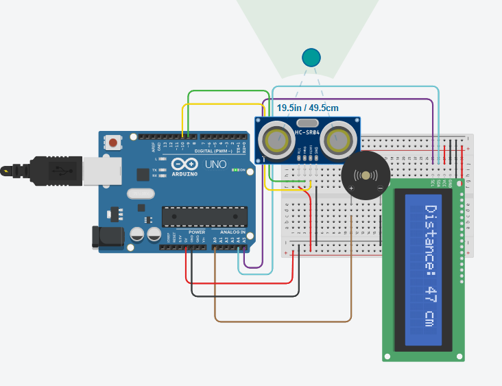

# 📏 Ultrasonic Distance Alarm

Arduino Uno와 초음파 센서, 16×2 LCD, 부저를 이용하여 제작한 **거리 측정 및 경고음 시스템**입니다.

초음파 센서로 물체와의 거리를 측정하고, 측정된 거리를 LCD에 표시합니다. 물체가 가까워질수록 부저의 주파수를 변경하여 거리 변화를 소리로 확인할 수 있도록 구현했습니다.

## 📷 Circuit

Tinkercad에서 제작한 회로입니다.



## 🔧 Components

* Arduino Uno
* Ultrasonic Sensor
* 16×2 LCD
* Buzzer
* Jumper Wires
* Breadboard

## 🔌 Pin Configuration

| Component          | Arduino Pin | Function         |
| ------------------ | ----------: | ---------------- |
| Ultrasonic Trigger |          D9 | Trigger Signal   |
| Ultrasonic Echo    |         D10 | Echo Signal      |
| Buzzer             |          A0 | Warning Sound    |
| LCD                |         I2C | Distance Display |

## ⚙️ How It Works

초음파 센서의 Trigger 핀에 약 10μs의 신호를 보내 초음파를 발생시킵니다.

초음파가 물체에 반사되어 돌아오면 Echo 핀의 신호 지속 시간을 측정하고, 이를 이용하여 거리를 계산합니다.

```text
Trigger
   │
   ▼
Ultrasonic Sensor ───────▶ Object
                              │
                              ▼
                        Reflected Wave
                              │
                              ▼
Echo ─────────────────────────┘
              │
              ▼
        Calculate Distance
              │
       ┌──────┴──────┐
       ▼             ▼
      LCD          Buzzer
    Distance      Warning
```

## 📏 Distance Measurement

거리 계산에는 초음파의 왕복 시간을 이용합니다.

```text
Distance = Echo Time × 0.034 / 2
```

왕복 거리를 측정하기 때문에 `2`로 나누어 실제 물체까지의 거리를 계산합니다.

## 🔊 Buzzer Warning

측정된 거리에 따라 부저의 주파수가 변경됩니다.

| Distance |  Buzzer |
| -------: | ------: |
| 60–69 cm | 2500 Hz |
| 21–60 cm | 1500 Hz |
|  2–20 cm |  500 Hz |
| 70 cm 이상 |     OFF |
|  0 cm 이하 |     OFF |

물체가 가까워질수록 다른 주파수의 소리가 출력되도록 구성했습니다.

## 📺 LCD Display

LCD에는 현재 측정된 거리가 표시됩니다.

예:

```text
Distance:
45 cm
```

측정 범위를 벗어나면 다음과 같이 표시됩니다.

```text
Distance:
Out of range
```

## 🧠 Main Features

* 📡 초음파 센서를 이용한 거리 측정
* 📏 실시간 거리 계산
* 📺 16×2 LCD 거리 표시
* 🔊 거리별 부저 주파수 변경
* 🚫 측정 범위를 벗어나면 부저 OFF
* 🔄 약 0.5초마다 거리 업데이트
* 💻 Tinkercad에서 회로 시뮬레이션

## 🛠️ Platform

* **Simulation:** Tinkercad Circuits
* **Board:** Arduino Uno
* **Language:** C++ (Arduino)
* **Sensor:** Ultrasonic Sensor
* **Display:** 16×2 LCD
* **Output:** Buzzer

## 📁 Project Structure

```text
ultrasonic-lcd-alarm/
├── README.md
└── ultrasonic-lcd.png
```

## 📌 Notes

본 프로젝트는 초음파 센서의 Echo 신호를 이용하여 물체까지의 거리를 계산하고, LCD와 부저를 통해 측정 결과를 출력하는 임베디드 시스템 실습 프로젝트입니다.
