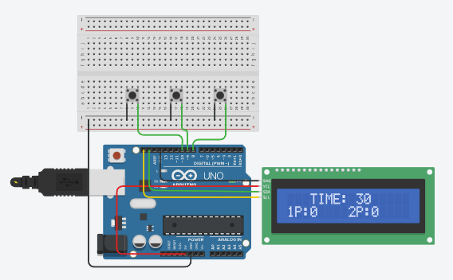

# 🎮 Two-Player Button Game

Tinkercad에서 Arduino와 LCD, 버튼을 이용하여 제작한 **2인용 버튼 게임**입니다.

START 버튼을 누르면 30초 동안 게임이 시작되며, 제한 시간 동안 각 플레이어가 자신의 버튼을 누른 횟수를 점수로 기록합니다.

## 📷 Circuit

Tinkercad에서 제작한 2인용 버튼 게임 회로입니다.



## 🔧 Components

* Arduino Uno
* 16×2 LCD
* Push Button × 3
* Jumper Wires
* Breadboard

## 🔌 Pin Configuration

| Component    | Arduino Pin | Function           |
| ------------ | ----------: | ------------------ |
| 1P Button    |         D10 | 1P Score +1        |
| 2P Button    |          D9 | 2P Score +1        |
| START Button |          D8 | Start / Reset Game |
| LCD          |         I2C | Display            |

## 🎮 How to Play

### 1. Start Game

**START 버튼(D8)**을 누르면 게임이 시작됩니다.

게임이 시작되면:

* 제한 시간이 **30초**로 설정됩니다.
* 1P 점수가 `0`으로 초기화됩니다.
* 2P 점수가 `0`으로 초기화됩니다.

### 2. Score

게임이 진행되는 동안:

* **1P 버튼(D10)**을 누르면 1P 점수가 1 증가합니다.
* **2P 버튼(D9)**을 누르면 2P 점수가 1 증가합니다.

### 3. Time Limit

게임 시간은 총 **30초**입니다.

1초마다 시간이 1초씩 감소하며, 시간이 `0`이 되면 게임이 종료됩니다.

게임이 종료되면 더 이상 점수가 증가하지 않습니다.

## 📺 LCD Display

LCD에는 현재 게임 상태가 표시됩니다.

```text
TIME: 30
1P:0    2P:0
```

게임이 진행되면 시간이 감소하고 각 플레이어의 버튼 입력 횟수가 표시됩니다.

예:

```text
TIME: 18
1P:12   2P:15
```

## 🔄 Game Flow

```text
        Power ON
           │
           ▼
      Waiting for START
           │
           │ START
           ▼
      Initialize Game
      TIME = 30 sec
      1P = 0 / 2P = 0
           │
           ▼
       Game Running
        │         │
        ▼         ▼
      1P +1      2P +1
        │         │
        └────┬────┘
             ▼
       Time decreases
             │
             ▼
         TIME = 0?
          /      \
        No        Yes
        │          │
        └───▶      ▼
              Game Over
```

## 💻 Code

```cpp
#include <Adafruit_LiquidCrystal.h>

#define BUTTON_1P 10
#define BUTTON_2P 9
#define BUTTON_START 8

Adafruit_LiquidCrystal lcd(0);

unsigned int buttonCnt1 = 0;
unsigned int buttonCnt2 = 0;

unsigned long currTime = 0;
unsigned long prevTime = 0;

unsigned int gameTime = 30;

bool gameRunning = false;

void setup() {
  pinMode(BUTTON_1P, INPUT_PULLUP);
  pinMode(BUTTON_2P, INPUT_PULLUP);
  pinMode(BUTTON_START, INPUT_PULLUP);

  lcd.begin(16, 2);

  displayGame();
}

void loop() {

  if (buttonStart() == 1) {
    gameTime = 30;
    buttonCnt1 = 0;
    buttonCnt2 = 0;

    currTime = millis();
    prevTime = currTime;

    gameRunning = true;

    displayGame();
  }

  if (gameRunning) {

    if (button1P() == 1) {
      buttonCnt1++;
    }

    if (button2P() == 1) {
      buttonCnt2++;
    }

    currTime = millis();

    if (currTime - prevTime >= 1000) {
      prevTime += 1000;

      if (gameTime > 0) {
        gameTime--;
      }

      if (gameTime == 0) {
        gameRunning = false;
      }

      displayGame();
    }
  }
}

void displayGame() {

  lcd.clear();

  lcd.setCursor(3, 0);
  lcd.print("TIME: ");
  lcd.print(gameTime);

  lcd.setCursor(0, 1);
  lcd.print("1P:");
  lcd.print(buttonCnt1);

  lcd.setCursor(8, 1);
  lcd.print("2P:");
  lcd.print(buttonCnt2);
}

int button1P() {

  static int oldSw = HIGH;
  int newSw = digitalRead(BUTTON_1P);

  if (newSw != oldSw) {
    oldSw = newSw;

    if (newSw == LOW) {
      delay(20);

      if (digitalRead(BUTTON_1P) == LOW) {
        return 1;
      }
    }
  }

  return 0;
}

int button2P() {

  static int oldSw = HIGH;
  int newSw = digitalRead(BUTTON_2P);

  if (newSw != oldSw) {
    oldSw = newSw;

    if (newSw == LOW) {
      delay(20);

      if (digitalRead(BUTTON_2P) == LOW) {
        return 1;
      }
    }
  }

  return 0;
}

int buttonStart() {

  static int oldSw = HIGH;
  int newSw = digitalRead(BUTTON_START);

  if (newSw != oldSw) {
    oldSw = newSw;

    if (newSw == LOW) {
      delay(20);

      if (digitalRead(BUTTON_START) == LOW) {
        return 1;
      }
    }
  }

  return 0;
}
```

## 🛠️ Platform

* **Simulation:** Tinkercad Circuits
* **Board:** Arduino Uno
* **Language:** C++ (Arduino)
* **Display:** 16×2 LCD

## 📌 Features

* 🎮 2인용 버튼 게임
* ⏱️ 30초 제한 시간
* 🏆 플레이어별 버튼 입력 횟수 기록
* 📺 LCD 실시간 점수 및 시간 표시
* 🔘 START 버튼을 이용한 게임 초기화
* 🔄 `millis()` 기반 타이머
* 🛡️ `INPUT_PULLUP`을 이용한 버튼 입력
