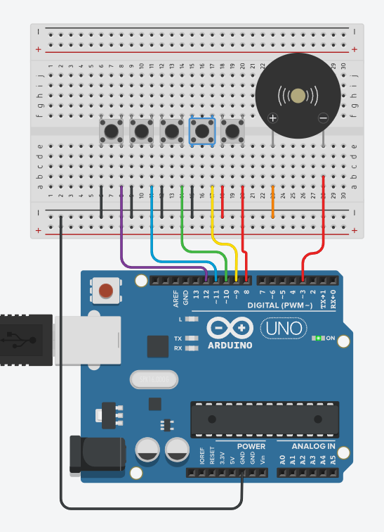

# 🎹 Arduino Piano

Tinkercad에서 Arduino와 피에조 부저, 5개의 스위치를 이용하여 제작한 **간단한 피아노 프로젝트**입니다.

각 스위치를 누르면 서로 다른 음계가 피에조 부저를 통해 출력됩니다.

## 📷 Circuit

Tinkercad에서 제작한 피아노 회로입니다.



## 🔧 Components

* Arduino Uno
* Piezo Buzzer
* Push Button × 5
* Jumper Wires
* Breadboard

## 🔌 Pin Configuration

| Component    | Arduino Pin | Note         |
| ------------ | ----------: | ------------ |
| Piezo Buzzer |          D3 | Sound Output |
| SW1          |         D12 | C (도)        |
| SW2          |         D11 | D (레)        |
| SW3          |         D10 | E (미)        |
| SW4          |          D9 | F (파)        |
| SW5          |          D8 | G (솔)        |

## 🎵 How It Works

각 버튼에는 서로 다른 주파수의 음이 지정되어 있습니다.

| Button | Note  | Frequency |
| ------ | ----- | --------: |
| SW1    | C (도) |    262 Hz |
| SW2    | D (레) |    294 Hz |
| SW3    | E (미) |    330 Hz |
| SW4    | F (파) |    349 Hz |
| SW5    | G (솔) |    392 Hz |

버튼을 누르면 `tone()` 함수를 이용하여 해당 주파수의 소리를 피에조 부저에서 출력합니다.

버튼을 누르지 않으면 `noTone()`을 사용하여 부저의 소리를 멈춥니다.

## 💻 Code

```cpp
#define PIEZO_BUZZER 3
#define SW1 12
#define SW2 11
#define SW3 10
#define SW4 9
#define SW5 8

void setup() {
  pinMode(SW1, INPUT_PULLUP);
  pinMode(SW2, INPUT_PULLUP);
  pinMode(SW3, INPUT_PULLUP);
  pinMode(SW4, INPUT_PULLUP);
  pinMode(SW5, INPUT_PULLUP);
}

void loop(){
  if(digitalRead(SW1) == 0) tone(PIEZO_BUZZER, 262, 1000);
  else if(digitalRead(SW2) == 0) tone(PIEZO_BUZZER, 294, 1000);
  else if(digitalRead(SW3) == 0) tone(PIEZO_BUZZER, 330, 1000);
  else if(digitalRead(SW4) == 0) tone(PIEZO_BUZZER, 349, 1000);
  else if(digitalRead(SW5) == 0) tone(PIEZO_BUZZER, 392, 1000);
  else noTone(PIEZO_BUZZER);
}
```

## 🛠️ Platform

* **Simulation:** Tinkercad Circuits
* **Board:** Arduino Uno
* **Language:** C++ (Arduino)

## 📌 Features

* 🎹 5개의 버튼을 이용한 피아노 구현
* 🔊 피에조 부저를 이용한 음 출력
* 🎵 도, 레, 미, 파, 솔 음계 구현
* 🔘 `INPUT_PULLUP`을 이용한 버튼 입력
* 🔇 버튼을 누르지 않을 때 자동으로 소리 정지

