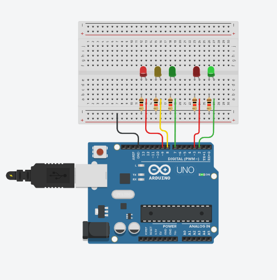

# 🚦 Traffic Light & Pedestrian Signal

Arduino를 이용하여 제작한 **자동차 신호등과 보행자 신호등 시스템**입니다.

자동차 신호등과 보행자 신호등이 정해진 시간에 따라 순서대로 변경되며, 보행자 신호가 끝날 때는 녹색 LED가 깜빡이도록 구현했습니다.

## 📷 picture



## 🔧 Components

* Arduino Uno
* Red LED × 2
* Yellow LED × 1
* Green LED × 2
* Resistors
* Breadboard
* Jumper Wires

## 🔌 Pin Configuration

| Component       | Arduino Pin |
| --------------- | ----------: |
| Car Red LED     |          D9 |
| Car Yellow LED  |          D8 |
| Car Green LED   |          D7 |
| Human Red LED   |          D3 |
| Human Green LED |          D2 |

## 📷 Circuit

Tinkercad에서 제작한 자동차 및 보행자 신호등 회로입니다.


## 💡 How It Works

신호등은 다음과 같은 순서로 동작합니다.

### 1. 🟢 Car Green / 🔴 Human Red

* 자동차 신호: 초록불
* 보행자 신호: 빨간불
* 지속 시간: **5초**

자동차가 통행할 수 있고, 보행자는 건널 수 없습니다.

### 2. 🟡 Car Yellow / 🔴 Human Red

* 자동차 신호: 노란불
* 보행자 신호: 빨간불
* 지속 시간: **5초**

자동차 신호가 초록불에서 노란불로 변경됩니다.

### 3. 🔴 Car Red / 🟢 Human Green

* 자동차 신호: 빨간불
* 보행자 신호: 초록불
* 지속 시간: **2초**

자동차가 정지하고 보행자가 건널 수 있습니다.

### 4. 🟢 Human Green Blinking

보행자 신호의 초록색 LED가 **0.5초 간격으로 3번 깜빡입니다.**

보행자에게 신호가 곧 종료된다는 것을 알려주는 역할을 합니다.

## ⏱️ Signal Sequence

```text
🚗 Green  + 🚶 Red    → 5 sec
🚗 Yellow + 🚶 Red    → 5 sec
🚗 Red    + 🚶 Green  → 2 sec
🚗 Red    + 🚶 Blink  → 3 times
                          ↓
                       Repeat
```

## 💻 Code

```cpp
#define CAR_LED_RED 9
#define CAR_LED_YELLOW 8
#define CAR_LED_GREEN 7
#define HUMAN_LED_RED 3
#define HUMAN_LED_GREEN 2

void setup() {
  pinMode(CAR_LED_RED, OUTPUT);
  pinMode(CAR_LED_YELLOW, OUTPUT);
  pinMode(CAR_LED_GREEN, OUTPUT);
  pinMode(HUMAN_LED_RED, OUTPUT);
  pinMode(HUMAN_LED_GREEN, OUTPUT);
}

void loop() {
  digitalWrite(CAR_LED_RED, LOW);
  digitalWrite(CAR_LED_YELLOW, LOW);
  digitalWrite(CAR_LED_GREEN, HIGH);
  digitalWrite(HUMAN_LED_RED, HIGH);
  digitalWrite(HUMAN_LED_GREEN, LOW);
  delay(5000);

  digitalWrite(CAR_LED_RED, LOW);
  digitalWrite(CAR_LED_YELLOW, HIGH);
  digitalWrite(CAR_LED_GREEN, LOW);
  digitalWrite(HUMAN_LED_RED, HIGH);
  digitalWrite(HUMAN_LED_GREEN, LOW);
  delay(5000);

  digitalWrite(CAR_LED_RED, HIGH);
  digitalWrite(CAR_LED_YELLOW, LOW);
  digitalWrite(CAR_LED_GREEN, LOW);
  digitalWrite(HUMAN_LED_RED, LOW);
  digitalWrite(HUMAN_LED_GREEN, HIGH);
  delay(2000);

  digitalWrite(HUMAN_LED_GREEN, LOW);
  delay(500);

  digitalWrite(HUMAN_LED_GREEN, HIGH);
  delay(500);

  digitalWrite(HUMAN_LED_GREEN, LOW);
  delay(500);

  digitalWrite(HUMAN_LED_GREEN, HIGH);
  delay(500);

  digitalWrite(HUMAN_LED_GREEN, LOW);
  delay(500);

  digitalWrite(HUMAN_LED_GREEN, HIGH);
  delay(500);
}

## 🛠️ Platform

- **Simulation:** Tinkercad Circuits
- **Board:** Arduino Uno
- **Language:** C++ (Arduino)

## 📌 Features

- 🚗 자동차 신호등 구현
- 🚶 보행자 신호등 구현
- ⏱️ 시간에 따른 자동 신호 변경
- 💡 보행자 녹색 신호 깜빡임 구현
- 🔄 신호 순서 자동 반복
```

참고로 **현재 코드 그대로라면 마지막 `HUMAN_LED_GREEN`이 `HIGH`인 상태로 `loop()`가 끝나기 때문에**, 다시 처음으로 돌아갈 때까지 보행자 초록불이 켜진 상태가 잠깐 유지돼. README에는 일단 **코드의 실제 동작 기준**으로 작성했어.
