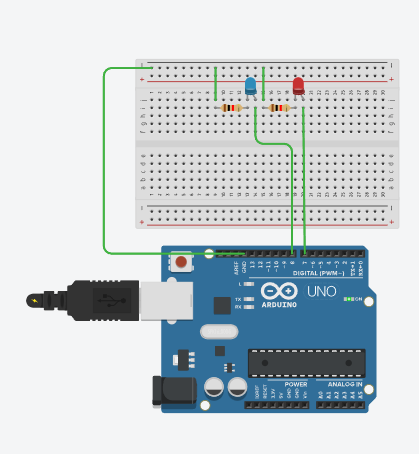

# 🚨 LED Warning Light

Tinkercad에서 Arduino를 이용하여 제작한 간단한 **경광등(Warning Light)** 프로젝트입니다.

두 개의 LED가 일정한 간격으로 번갈아 켜지면서 경광등처럼 동작합니다.



## 🔧 Components

* Arduino Uno
* Blue LED
* Red LED
* 220Ω Resistor × 2
* Breadboard
* Jumper Wires

## 🔌 Pin Configuration

| Component | Arduino Pin |
| --------- | ----------- |
| Blue LED  | D8          |
| Red LED   | D7          |

## 💡 How It Works

프로그램이 실행되면 다음과 같은 순서로 LED가 동작합니다.

1. 파란색 LED가 켜지고 빨간색 LED가 꺼집니다.
2. 80ms 동안 유지됩니다.
3. 빨간색 LED가 켜지고 파란색 LED가 꺼집니다.
4. 다시 80ms 동안 유지됩니다.
5. 위 과정을 계속 반복합니다.

따라서 두 LED가 빠르게 번갈아 점멸하면서 **경광등과 같은 효과**를 만듭니다.

## 💻 Code

```cpp
#define LED_BLUE 8
#define LED_RED 7
#define DELAY_TIME 80

void setup(){
  pinMode(LED_BLUE, OUTPUT);
  pinMode(LED_RED, OUTPUT);
}

void loop() {
  digitalWrite(LED_BLUE, HIGH);
  digitalWrite(LED_RED, LOW);
  delay(DELAY_TIME);

  digitalWrite(LED_RED, HIGH);
  digitalWrite(LED_BLUE, LOW);
  delay(DELAY_TIME);
}
```

## 🛠️ Platform

* **Simulation:** Tinkercad Circuits
* **Board:** Arduino Uno
* **Language:** C/C++ (Arduino)

## 📌 Result

파란색 LED와 빨간색 LED가 약 **80ms 간격으로 번갈아 점멸**하여 차량이나 긴급 상황에서 사용하는 경광등과 비슷한 효과를 구현합니다.
